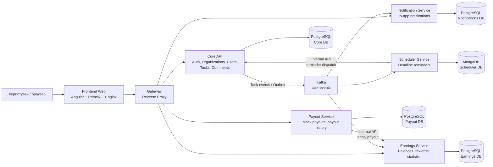

# Field Task Manager

## Notes

Загальні витрачені години на проєкт: приблизно **8-10 годин**.

За цей час було розгорнуто мікросервісну **event-driven** архітектуру з такими сервісами:

- **Frontend Web** - Angular застосунок, який віддається через nginx.
- **Gateway** - єдина точка входу для frontend, проксі до backend-сервісів.
- **Core API** - основний сервіс автентифікації, організацій, користувачів, завдань і коментарів.
- **Notification Service** - обробка подій завдань і внутрішніх сповіщень.
- **Scheduler Service** - планування нагадувань по дедлайнах завдань.
- **Earnings Service** - нарахування винагороди за підтверджені завдання, баланси та статистика.
- **Payout Service** - мок-виплати користувачам із фіксацією історії виплат.
- **Kafka** - брокер подій для взаємодії сервісів.

Я свідомо відійшов від стандартного ТЗ і побудував реалізацію на основі **організацій**. Тобто в системі є три ролі:

- **Super Admin** - керує організаціями.
- **Org Admin** - адміністратор конкретної організації, керує користувачами, завданнями, виплатами та статистикою.
- **Worker** - виконавець організації, бачить свої завдання, змінює статуси, додає коментарі та переглядає власний баланс/історію виплат.

Базове ТЗ покрите повністю, а зверху додано організаційну модель, event-driven комунікацію, окремі сервіси для нотифікацій, планування, нарахувань і виплат.

## Архітектура застосунку



## Що вміє застосунок

### Frontend Web

- Авторизація, реєстрація організації та локалізований інтерфейс EN/UA.
- Окремі робочі простори для Super Admin, Org Admin і Worker.
- Список завдань із пошуком, фільтрами, статусами, дедлайнами та винагородою.
- Детальна сторінка завдання з мапою, drag-and-drop редагуванням локації та коментарями.
- Мапа завдань із маркерами за статусами та фільтрами по датах/користувачах.
- Статистика задач і історія виплат.

### Core API

- JWT-автентифікація та role-based access control.
- Автоматичне створення Super Admin під час першого запуску.
- Управління організаціями, користувачами, завданнями та коментарями.
- Workflow задач: `Created -> InProgress -> Done -> Verified`.
- Повернення задачі в роботу адміністратором організації.
- Outbox-публікація task events у Kafka.

### Gateway

- Єдина точка входу для frontend.
- Проксіювання `/api` запитів до відповідних backend-сервісів.
- Дозволяє frontend працювати без hardcoded URL для кожного сервісу.

### Notification Service

- Читає події задач із Kafka.
- Створює внутрішні сповіщення для користувачів.
- Підтримує unread count і список сповіщень.
- Має власну PostgreSQL базу.

### Scheduler Service

- Читає task events із Kafka.
- Планує нагадування по дедлайнах задач.
- Зберігає scheduled jobs у MongoDB.
- Через internal API ініціює reminder-події.

### Earnings Service

- Читає `TaskVerified` події з Kafka.
- Нараховує винагороду за підтверджені задачі.
- Веде баланс користувача окремо по валютах `USD` і `UAH`.
- Надає статистику заробітку, доступного балансу та історію task rewards.

### Payout Service

- Дозволяє Org Admin створювати мок-виплати користувачам.
- Зберігає payout history та статуси виплат.
- Списує баланс через internal API Earnings Service.
- Worker може переглядати власну історію виплат.

### Інфраструктура

- PostgreSQL для core, notifications, earnings і payouts.
- MongoDB для scheduler jobs.
- Kafka як event bus між сервісами.
- Docker Compose для запуску всієї системи однією командою.
- nginx для віддачі Angular SPA та проксі `/api`.

## Запуск проєкту

Для запуску потрібен встановлений **Docker** з compose plugin. `make` бажаний, але не обов'язковий.

```bash
git clone <repo-url>
cd ftm
make run
```

Якщо `make` недоступний, можна запустити напряму через Docker Compose:

```bash
git clone <repo-url>
cd ftm
docker compose up --build -d
```

Після запуску:

| Що | URL |
| --- | --- |
| Web-застосунок | http://localhost:8080 |

Тестовий Super Admin створюється автоматично під час першого запуску:

```text
Email: superadmin@ftm.local
Password: Admin123!
```

Корисні команди:

```bash
make logs   # перегляд логів усіх сервісів
make stop   # зупинити контейнери
make clean  # зупинити контейнери та видалити volumes/images проєкту
```
