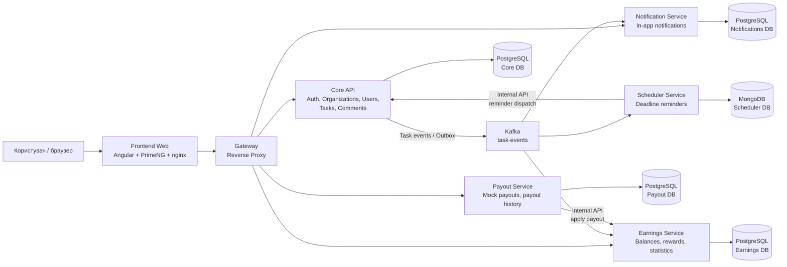

# Field Task Manager

## Notes

Загальні витрачені години на проєкт: приблизно **8-10 годин**.

За цей час було розгорнуто мікросервісну **event-driven** архітектуру з такими сервісами:

- **Frontend Web** - Angular застосунок, який віддається через nginx.
- **Gateway** - єдина точка входу для frontend, проксі до backend-сервісів.
- **Core API** - основний сервіс автентифікації, організацій, користувачів, завдань і коментарів.
- **Notification Service** - обробка подій завдань і внутрішніх сповіщень.
- **Scheduler Service** - планування нагадувань по дедлайнах завдань.
- **Earnings Service** - нарахування винагороди за підтверджені завдання, баланси та статистика.
- **Payout Service** - мок-виплати користувачам із фіксацією історії виплат.
- **Kafka** - брокер подій для взаємодії сервісів.

Я свідомо відійшов від стандартного ТЗ і побудував реалізацію на основі **організацій**. Тобто в системі є три ролі:

- **Super Admin** - керує організаціями.
- **Org Admin** - адміністратор конкретної організації, керує користувачами, завданнями, виплатами та статистикою.
- **Worker** - виконавець організації, бачить свої завдання, змінює статуси, додає коментарі та переглядає власний баланс/історію виплат.

Базове ТЗ покрите повністю, а зверху додано організаційну модель, event-driven комунікацію, окремі сервіси для нотифікацій, планування, нарахувань і виплат.

## Архітектура застосунку

